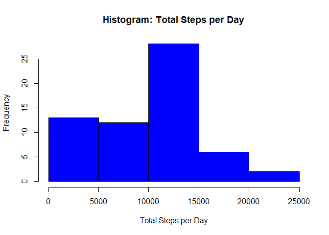
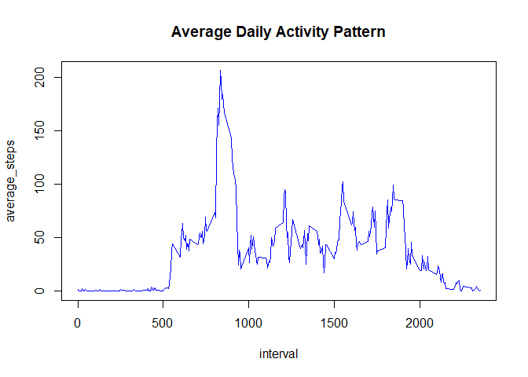
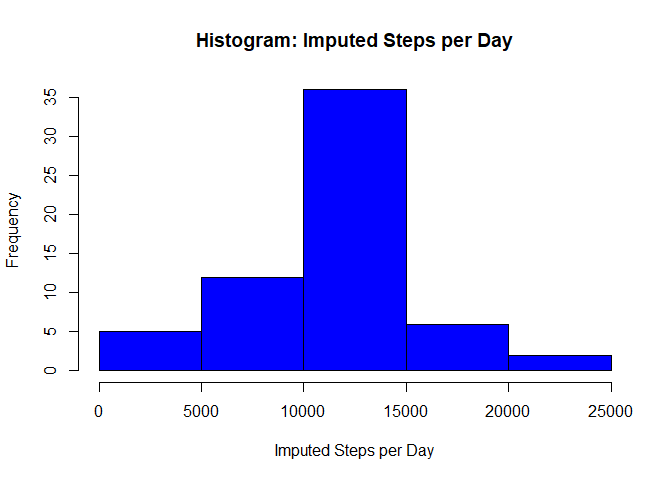
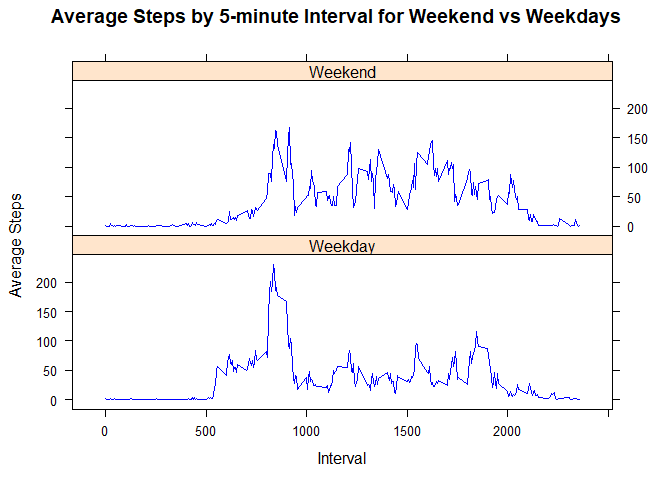

```r
library(dplyr)
```

```
## 
## Attaching package: 'dplyr'
```

```
## The following objects are masked from 'package:stats':
## 
##     filter, lag
```

```
## The following objects are masked from 'package:base':
## 
##     intersect, setdiff, setequal, union
```

```r
library(lattice)
```


## Loading and preprocessing the data


```r
# download zip file
# to force a download uncomment the if statement below

datasource <- "https://d396qusza40orc.cloudfront.net/repdata%2Fdata%2Factivity.zip"
if (!file.exists("activity.zip")) 
{
	download.file(datasource, destfile = "activity.zip", method = "curl")
}

# unzip the data

datafile <- "activity.csv"
if (!file.exists(datafile)) 
{
	unzip("activity.zip")
}

# load data

activity <- read.csv(datafile, header = TRUE)
#nrow(activity)
head(activity)
```

```
##   steps       date interval
## 1    NA 2012-10-01        0
## 2    NA 2012-10-01        5
## 3    NA 2012-10-01       10
## 4    NA 2012-10-01       15
## 5    NA 2012-10-01       20
## 6    NA 2012-10-01       25
```

```r
summary(activity)
```

```
##      steps                date          interval     
##  Min.   :  0.00   2012-10-01:  288   Min.   :   0.0  
##  1st Qu.:  0.00   2012-10-02:  288   1st Qu.: 588.8  
##  Median :  0.00   2012-10-03:  288   Median :1177.5  
##  Mean   : 37.38   2012-10-04:  288   Mean   :1177.5  
##  3rd Qu.: 12.00   2012-10-05:  288   3rd Qu.:1766.2  
##  Max.   :806.00   2012-10-06:  288   Max.   :2355.0  
##  NA's   :2304     (Other)   :15840
```

## What is mean total number of steps taken per day?

1. Calculate the total number of steps taken per day
2. Make a histogram of the total number of steps taken each day
3. Calculate and report the mean and median of the total number of steps taken per day


```r
total_steps_per_day <- activity %>% 
                       group_by(date) %>% 
                       summarize(total_steps = sum(steps, na.rm = TRUE))

hist(total_steps_per_day$total_steps,
     main="Histogram: Total Steps per Day",
     xlab="Total Steps per Day",
     ylab="Frequency",
     col="blue")
```

<!-- -->

```r
mean_total_steps <- mean(total_steps_per_day$total_steps)
median_total_steps <- median(total_steps_per_day$total_steps)
```

==> Median number of steps taken each day: 10395.  
==> Mean number of steps taken each day: 9354.2295082.  
  

## What is the average daily activity pattern?

1. Make a time series plot of the 5-minute interval (x-axis) and the average number of steps taken, averaged across all days (y-axis)


```r
daily_pattern <- activity %>% 
                 group_by(interval) %>% 
                 summarize(average_steps = mean(steps, na.rm = TRUE))

daily_pattern
```

```
## # A tibble: 288 x 2
##    interval average_steps
##       <int>         <dbl>
##  1        0        1.72  
##  2        5        0.340 
##  3       10        0.132 
##  4       15        0.151 
##  5       20        0.0755
##  6       25        2.09  
##  7       30        0.528 
##  8       35        0.868 
##  9       40        0     
## 10       45        1.47  
## # ... with 278 more rows
```

```r
#daily_pattern$average_steps

plot(daily_pattern, 
     type = "l", 
     main = "Average Daily Activity Pattern",
     col = "blue")
```

<!-- -->

2. Which 5-minute interval, on average across all the days in the dataset, contains the maximum number of steps?


```r
max_index <- which.max(daily_pattern$average_steps)
#max_index
#daily_pattern[max_index,1]
```

==> The maximum average number of steps occur at interval index 104 (835)  
  

## Imputing missing values

1. Calculate and report the total number of missing values in the dataset (i.e. the total number of rows with NAs):

```r
# calculate total number of missing values in the dataset

total_missing_values <- sum(is.na(activity))
total_missing_values
```

```
## [1] 2304
```
==> The total number of missing values in the dataset is 2304.  
  
2. Devise a strategy for filling in all of the missing values in the dataset.

==> The missing values will be filled in with the (rounded) mean for the 5-minute interval

3. Create a new dataset that is equal to the original dataset but with the missing data filled in.  


```r
# create a new dataset equal to the original

activity.imputed <- activity

# run through, substituting all NA values with the mean

for (i in 1:nrow(activity.imputed)) 
{
    if (is.na(activity.imputed$steps[i]))
    {
       avg_steps <- daily_pattern[daily_pattern$interval == activity.imputed$interval[i],"average_steps"]
       activity.imputed$steps[i] <- as.integer(round(avg_steps))  
    }
}

# debug lines
# head(activity.imputed,20)
```

4. Make a histogram of the total number of steps taken each day and Calculate and report the mean and median total number of steps taken per day.


```r
imputed_steps_per_day <- activity.imputed %>% 
                         group_by(date) %>% 
                         summarize(imputed_steps = sum(steps, na.rm = TRUE))

hist(imputed_steps_per_day$imputed_steps,
     main="Histogram: Imputed Steps per Day",
     xlab="Imputed Steps per Day",
     ylab="Frequency",
     col="blue")
```

<!-- -->

```r
mean_imputed_steps <- mean(imputed_steps_per_day$imputed_steps)
median_imputed_steps <- median(imputed_steps_per_day$imputed_steps)
```

==> (Imputed) Median number of steps taken each day: 10762.  
==> (Imputed) Mean number of steps taken each day: 10765. 

#### Observations
==> Imputing missing data with average values will have a normalising effect on the histogram.  
==> Imputing missing data with average values also brings the mean and median much closer to each other.


## Are there differences in activity patterns between weekdays and weekends?

1. Create a new factor variable in the dataset with two levels - "weekday" and "weekend" indicating whether a given date is a weekday or weekend day.


```r
# add qualifyers to imputed dataset indicating week or weekend days

activity.imputed <- mutate(activity.imputed, day = weekdays(as.Date(date)))
activity.imputed <- mutate(activity.imputed, daytype = as.factor(ifelse(day == "Saturday" | day == "Sunday", "Weekend", "Weekday")))
head(activity.imputed)
```

```
##   steps       date interval    day daytype
## 1     2 2012-10-01        0 Monday Weekday
## 2     0 2012-10-01        5 Monday Weekday
## 3     0 2012-10-01       10 Monday Weekday
## 4     0 2012-10-01       15 Monday Weekday
## 5     0 2012-10-01       20 Monday Weekday
## 6     2 2012-10-01       25 Monday Weekday
```

```r
# create daily pattern to include weekend qualifier as key

daily_pattern_by_daytype <- activity.imputed %>% 
                 group_by(daytype,interval) %>% 
                 summarize(average_steps = mean(steps))
head(daily_pattern_by_daytype)
```

```
## # A tibble: 6 x 3
## # Groups:   daytype [1]
##   daytype interval average_steps
##   <fct>      <int>         <dbl>
## 1 Weekday        0        2.29  
## 2 Weekday        5        0.4   
## 3 Weekday       10        0.156 
## 4 Weekday       15        0.178 
## 5 Weekday       20        0.0889
## 6 Weekday       25        1.58
```

2. Make a panel plot containing a time series plot of the 5-minute interval (x-axis) and the average number of steps taken, averaged across all weekday days or weekend days (y-axis).


```r
# plot the data split by weekend and weekday graphs

xyplot(average_steps ~ interval | daytype, 
       data = daily_pattern_by_daytype, 
       layout = c(1,2), 
       type = "l",
	    main = "Average Steps by 5-minute Interval for Weekend vs Weekdays",
	    xlab = "Interval",
	    ylab = "Average Steps",
	    col = "blue")
```

<!-- -->

#### Observation

==> Weekdays seems to have a higher activity level early in the morning, whereafter it flattens out.  
==> Weekends have a higher activity level throughout the rest of the day  

